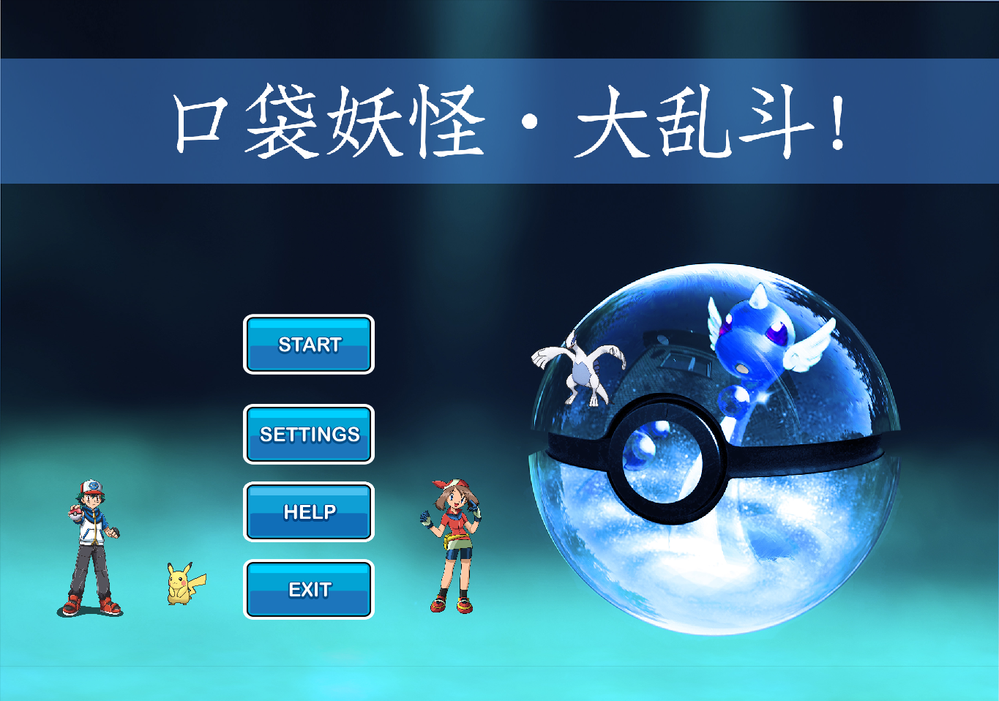
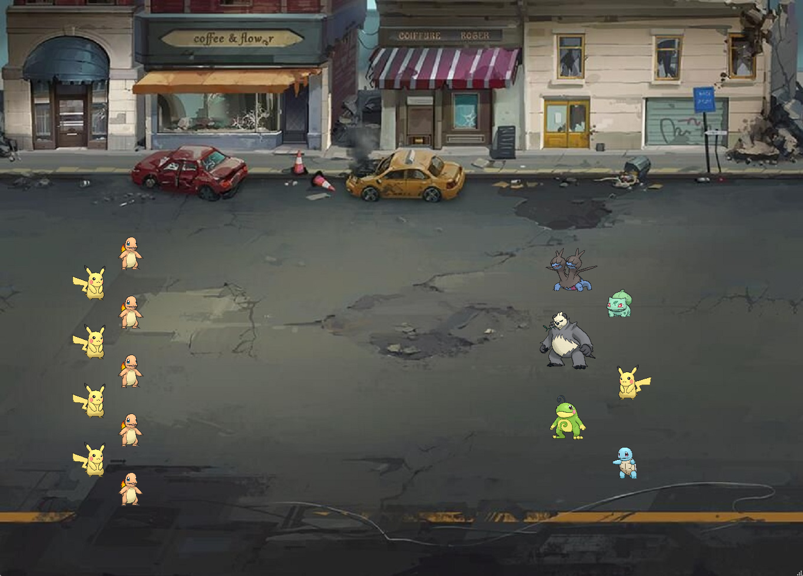

# Pokemon Fight

> 大一程序设计 Qt 制作的游戏。

本游戏是一个类似 [全面战争模拟器](https://store.steampowered.com/app/508440/Totally_Accurate_Battle_Simulator/?l=schinese&curator_clanid=32558408) 的电子斗蛐蛐游戏。基于 C++ 和 Qt 制作，因此只具备基础的游戏玩法，不包含战斗特效。

实现的功能（详见设计文档）：

- 音乐、帮助；
- 宝可梦自动寻敌和移动；
- 宝可梦的购买和拖动；
- 不同宝可梦的属性差异；
- 多个战斗场景；
- 战斗结算。

## Preview

